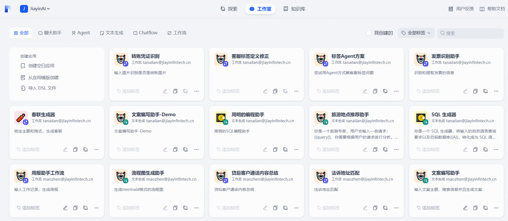

# 前言

## 一、开始之前：登录与入口

   1. **登录平台：**   
点击 [千机智能体研发平台](http://qianji-aisvc-web.jiayinfintech.cn/signin)，自动跳转到统一登录页面，用您的域账号登录。  
   2. **进入工作室：**   
登录成功后，进入平台的 **【工作室】** 页面。这是你创建和管理所有智能体的中心。  

## 二、课程目录
[零基础构建你的第一个智能体](ch1/ch1.1/c1.1.md)  
[零基础智能体搭建教程：Agent篇](ch1/ch1.1/c1.2.md)

## 三、后续学习与支持
   1. **了解更多应用类型：**   
- **Agent：** 能调用工具（如搜索、计算、API）执行任务的智能体。
- **文本生成：** 生成文章、报告、营销文案等。
- **Chatflow：** 可视化编排复杂对话流程（多轮对话、分支选择）。
- **工作流：** 自动化多步骤任务（结合LLM、工具、条件判断）。

**本教程专注于“聊天助手”，**

**我们会逐步推出其他应用类型智能体的开发教程以及其他专题的帮助文档，尽请关注！**

   2. **深入学习Dify：**   
千机平台基于Dify开发，其官方文档是深入学习的宝贵资源：[Dify官方文档](https://docs.dify.ai/zh-hans/ )  

   3. **寻求帮助：**   
- 企业微信扫码加入用户交流群：  

- 如二维码失效或者需要其他帮助，请联系以下任意同事：
  - 周杰 **(zhoujie3@jiayinfintech.cn)**
  - 王培 **(wangpei@jiayinfintech.cn)**
  - 徐向上 **(xuxiangshang@jiayinfintech.cn)**
  - 毛镇 **(maozhen@jiayinfintech.cn)**
