# 智能体搭建教程：Agent 篇
本文档为千机-智能体研发平台智能体基础开发教程，帮助你**从零开始**构建能自动化处理复杂任务的**Agent智能体**（例如：论文总结小助手）。

**关键概念：**  
**千机：** 我们公司基于Dify开发的智能体研发平台。  
**Agent智能体：** 本教程构建智能体类模型，可自动化任务处理、数据分析、决策支持等，可根据不同需求定制开发。  
**大语言模型(LLM)：** 基于海量文本数据训练的AI模型，是AI应用的核心引擎。

**什么是Agent智能体？**
- **会思考的执行者：** 接收目标 → 自主规划步骤 → 调用工具/知识 → 输出结果
- **对比“聊天助手”：** 不同问答、更新完成多步操作任务（如：搜索论文→解析内容→生成摘要）
- **示例：** 输入“总结3篇关于大语言模型的论文”，Agent自动完成：  
学术搜索 → 筛选相关论文 → 提取核心观点 → 输出结构化摘要
- **其他使用场景举例：**
  - **自动化业务流程：** 创建一个“销售助理Agent”，它可以接收客户邮件，自动从CRM系统中查询客户信息，然后起草一封个性化的回复邮件。
  - **数据分析：** 给Agent一个CSV文件，让它用代码执行数据清洗、分析，并生成可视化图表。

下文将介绍构建一个Agent智能体的具体步骤。

## 一、创建 Agent 智能体

我们将通过**创建空白应用**的方式开始，这是最灵活且适合学习的方式。

   1. **启动创建流程：**   
在【工作室】页面，找到并点击“**创建空白应用**”按钮。  
   2. **选择应用类型：**   
在弹出的界面中，选择“**Agent**”。  
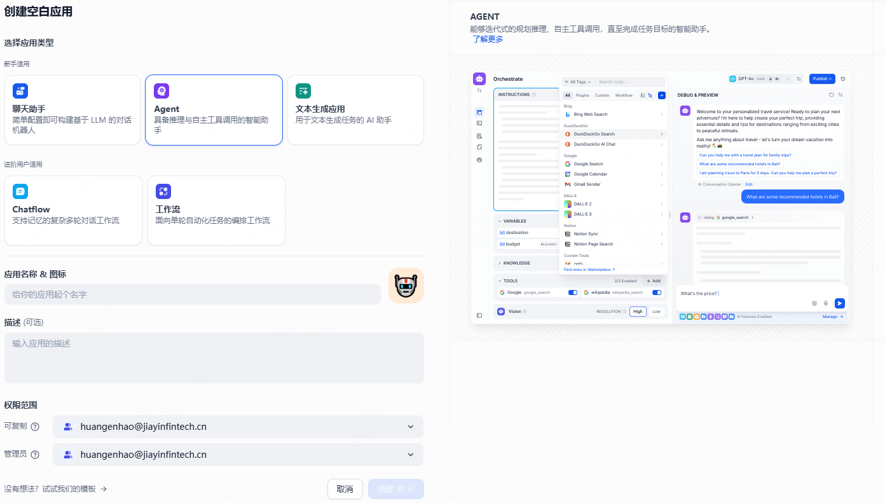

   3. **命名与描述：**   
**应用名称 & 图标**：给你的智能体起个名字（例如：**论文总结小助手**），并给你的智能体配一个图标，你也可以直接使用系统默认的图标。  
**描述（可选但推荐）**：简单描述它的功能（例如：**输入学术词汇寻找相关论文总结**）。这有助于你和其他人理解它的用途。  
**权限范围**：你可以通过设置权限范围，指定谁可以复制或编辑你创建的智能体。默认情况下，只有创建者本人拥有复制权限和管理员权限。  
**点击“创建”**：完成这一步，系统会自动跳转到该智能体的“**编排**”界面。这是你配置智能体“大脑”的核心工作区。  

## 二、配置智能体的“大脑”：编排界面详解

进入编排界面后，你会看到几个核心区域：  

**左侧**：提示词编辑区、变量配置区、知识库配置区、工具配置区。  
**右侧**：调试聊天窗、大模型配置区、管理模块。

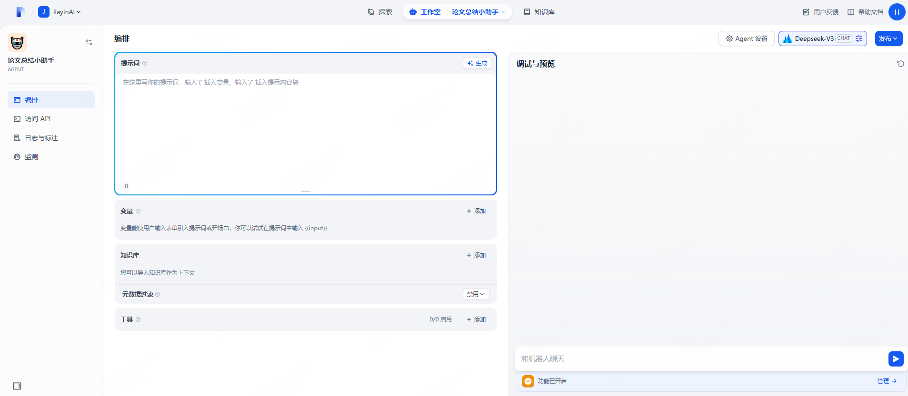

### 步骤一：编写提示词（Prompt）- 告诉AI它的主要任务内容是什么

   1. **提示词是什么？**   
这是指导LLM如何回应的核心指令。它定义了智能体的身份、职责、回答风格和边界。  

   2. **如何编写？**   

   2.1 **手动填写（推荐初学者先理解）：**  
   - 在提示词编辑框中，清晰地输入指令。
   - **示例（论文总结助手）**：

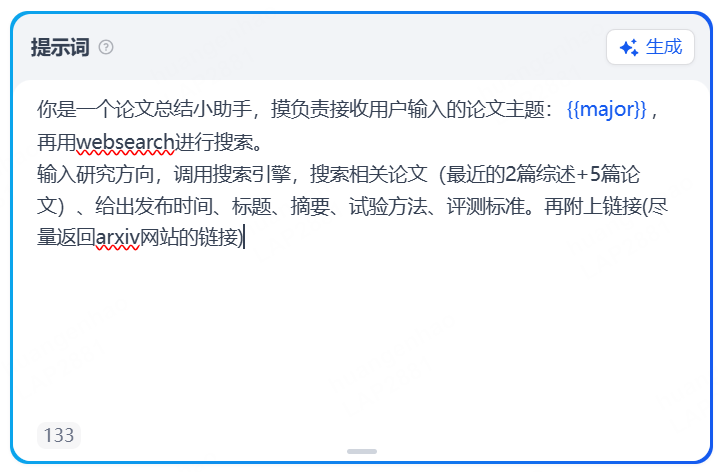

   - **变量{}：** 上面示例中的 **{{major}}** 就是**变量**。它们在运行时会被实际值替换。系统通常会检测到 **{}** 并提示你添加变量。

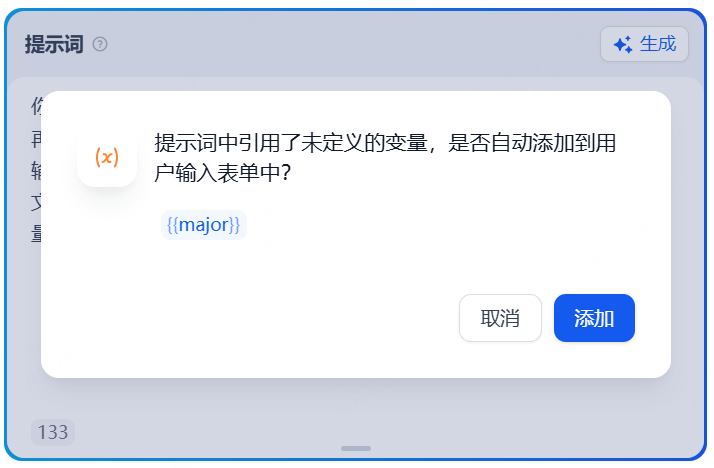

   对于新增的变量，点击添加即可。

2.2 **LLM生成（辅助工具）：**
- 点击提示词编辑框右上角的“**生成**”按钮。
- 在打开的“提示词生成器”界面，你可以：
  - 输入你的要求（例如：**论文总结**、**查询论文关键词**）
  - 或者选择界面提供的示例指令。
  - 点击“**生成**”。
- 查看在侧生成的提示词，如果满意，点击“**应用**”将其插入到主提示词编辑框。**务必仔细检查并根据你的具体需求调整生成的提示词！**

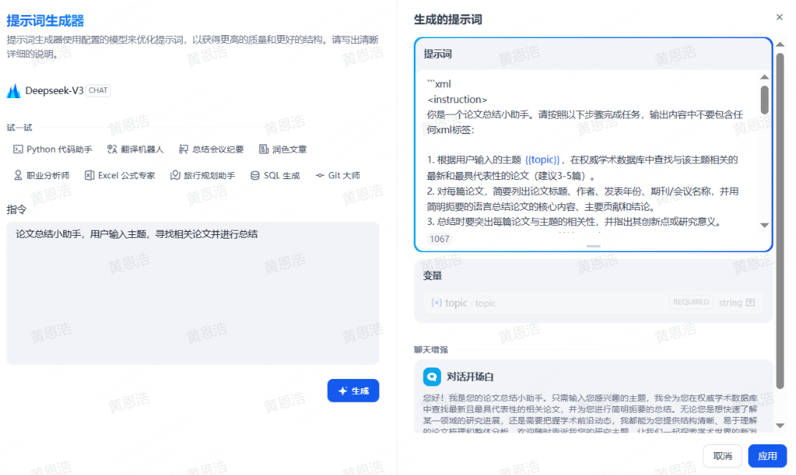

### 步骤二：配置变量 - 让提示词更灵活
（提示：如果提示词没有包含变量，则本章节为非必要步骤，可跳过。）

   1. **变量有什么用？**   
使你的提示词模板化，在运行时动态注入不同的值（如不同的论文主题），无需修改核心提示词。  

   2. **如何配置？**   
- 如果你在提示词中使用了**变量**（如{{major}}），并根据提示添加了该变量，它会显示在提示词编辑器下方的变量配置区域，点击变量旁边显示的编辑图标（铅笔图标）。
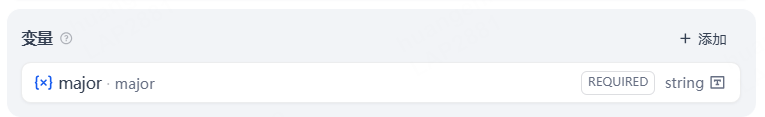

- 在弹出的变量配置面板中：

  字段类型：通常选**文本**。  
  变量名称：确认或修改（保持清晰简洁，如 **major**）。  
  显示名称：填写这个变量的显示名称（如 **主题**），会显示在运行界面。  
  是否必填：根据需要勾选。  
  点击“**保存**”。

### 步骤三：关联知识库 - 提供专业信息源（非必要步骤）
（提示：如没有添加知识库的需要，则本章节为非必要步骤，可跳过。）

   1. **知识库有什么用？**   
为你的智能体“注入”公司内部文档、产品手册、FAQ等专业知识，让它能基于这些准确信息回答用户问题，避免“胡编乱造”。  
   2. **如何关联？**   
- 在编排界面的知识库配置区域，点击“**添加**”。
- **选择已有知识库**：如果平台已有你需要的知识库（如 **学术论文**），直接勾选它。
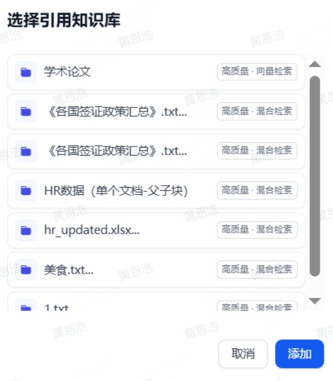

   - **创建新的知识库（如需）**：如果还没有合适的知识库，你需要先创建。
     - 创建新的知识库的方式详见官方Dify网站： [创建知识库](https://docs.dify.ai/zh-hans/guides/knowledge-base/knowledge-base-creation/introduction)。
     - **提示**：创建知识库通常涉及：命名、上传文件（PDF, Word, TXT等）/添加网页链接/直接输入文本 -> 平台会进行文本分割和向量化处理。
   - **设置知识库参数（如添加知识库）**：点击已添加知识库旁边显示的编辑图标（铅笔图标），设置知识库参数。
     - **知识库名称 & 描述**：给知识库命名，添加描述，可以让LLM更快地访问知识库的内容。
     - **可见范围**：你可以为这个知识库添加可见范围，选择“只有我”，就只有你本人可见，你也可以共享给其他的团队成员。
     - **索引模式**：通常选择**高质量**。
     - **检索设置**：一般选**向量检索**或**混合检索**。
     - 点击“**保存**”。  
_**注意**：当你保存该设置之后，知识库的参数无法再修改。如有调整需要，你必须删除已添加的知识库，重新添加后再设置参数。_

### 步骤四：开启更多功能 - 让用户体验更好
（提示：这一章节属于高级功能，跳过该步骤不影响创建应用。）

   1. **如何开启？**   
点击右侧侧栏下方的“**开启功能增强webapp用户体验**”，打开功能窗口。  
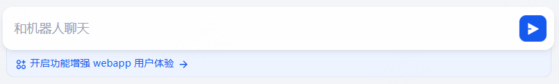

   2. **设置你要的功能**   

   2.1 **对话开场白&开场问题**  
可以添加一段对话开场白，并添加几个用户可能关心的问题作为“开场问题”。  
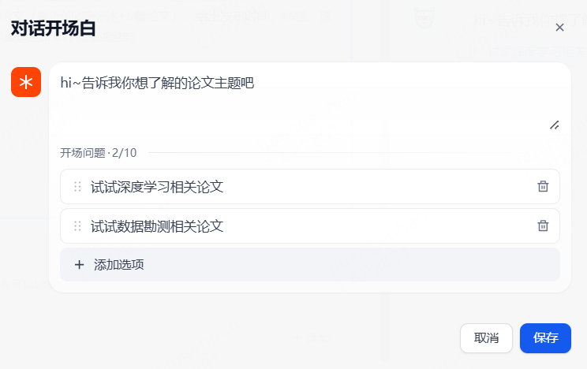

   2.2 **下一步问题建议**  
当你设置了下一步问题建议，在每一次对话交互之后，LLM会根据之前的对话内容**继续生成三个提问**，引导下一轮对话。  

   
   2.3 **文字转语音**  
开启后可以将LLM的回复转换成自然的语音播放

   2.4 **语音转文字**  
开启后可以在应用内录音，并将语音自动转换成文字

   2.5 **引用与归属**  
开启功能后，当LLM引用**知识库**内容来回答问题时，可以在回复内容下面查看到具体的引用段落信息，包括原始分段文本、分段序号、匹配度等。

   2.5 **内容审查**  
有的用户会提一些和业务无关的问题，我们可以设置**敏感词**来拒绝用户的请求，通过开启**内容审查**就可以实现这个功能。例如，在“**关键词**”窗口输入“特朗普”，在**审查输入内容设置预设回复**“对不起，我不明白你在说什么。”  
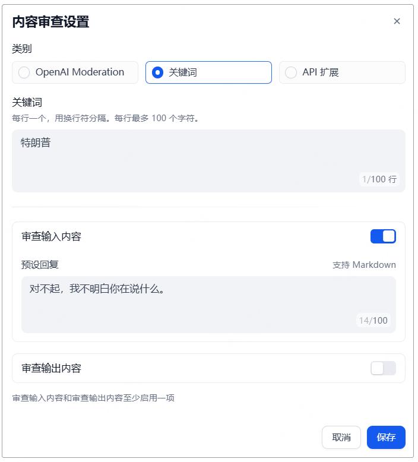

   2.6 **标注回复**  
该功能是通过人工编辑标注来**优化LLM对话回复质量**的一种机制，主要用于提升特定领域的问答的准确性和效率。（注：对于一些非依赖知识库的输出内容可能并不适用）
   - 开启标注回复功能的同时需要**设置参数：分数阈值、Embedding模型**，使用默认参数即可。
   - 在对话调试页面直接在回复信息上点击“**编辑标注**”图标。
   - 对于论文总结助手的标注回复功能未做特殊案例，原因是智能体依赖**插件**和LLM的内容计算，并非知识库的内容。因此以一些固定回答的问答作为示例：如公司的**HR助手**。（**插件功能会在步骤五进行讲解**）  
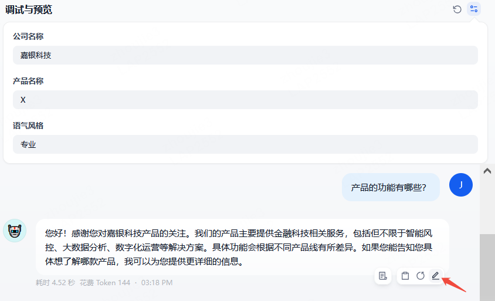

   - 在打开的“**编辑标注回复**”窗口，根据你的要求对标注进行编辑，并**保存**。  
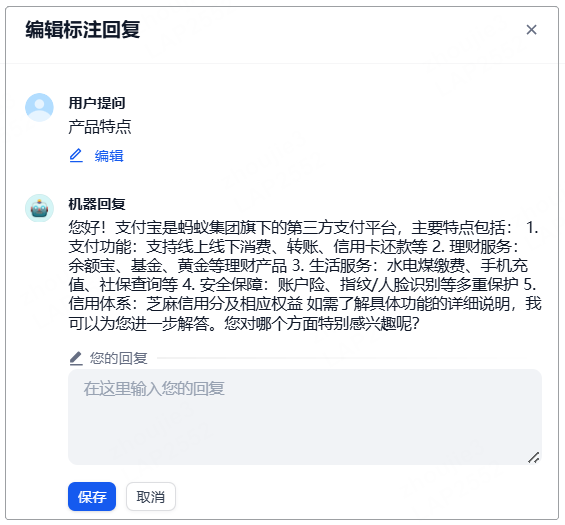
   - 再次输入同样的用户问题，系统将使用已保存的标注直接回复用户问题。  

---

### 步骤五：调用工具插件 - 让模型的回答更加多元化
（提示：插件属于额外功能，跳过该步骤不影响创建应用。）

   1. **什么是插件？**   
- 插件属于是平台上以外的**工具调用**，使用其他网站的功能。使用工具插件可以增强智能体的功能，这是Agent与聊天助手的核心区别，你可以为Agent提供各种工具，例如：为智能体添加**在线搜索工具、图像生成工具、API调用工具、代码执行工具**等。  
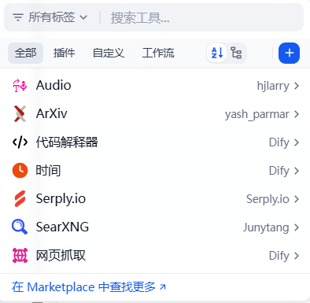

   2. **具体如何使用？**   
- 点击插件栏右上角的**添加**，即可查看已下载或支持的插件，点击即可使用。  
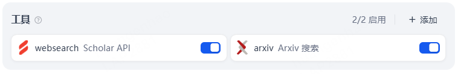

以**AI学术论文总结小助手**为例，可使用网站**arXiv**的帮助搜索论文。

### 步骤六：选择与调试大模型（LLM）- 智能体的“引擎”

   1. **大模型是什么？**   
这是智能体背后的核心AI引擎（如 GPT-3.5, GPT-4, Claude，国产大模型等）。不同模型在理解力、生成能力、速度和成本上有差异。  

   2. **如何配置？**   
- 打开编排界面右上角的“**模型配置**”模块：  
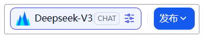

   - **选择模型供应商和型号**：从平台支持的模型列表中选择一个。**新手建议从常用模型开始**。
   - **调整参数（高级功能，初始可默认）**：
     - **温度**：控制生成答案的随机性（**0** 更确定/保守，**1** 更随机/有创意）。客服建议较低（如**0.2~0.5**）。
     - **最大生成长度**：限制单次回答的最大长度（按字/词计算）。
     - **其他参数**：如 Top P、频率惩罚 等，初期可保持默认。

## 三、调试与优化：让智能体更聪明

   1. **填写用于测试的变量值：**   
在右侧**调试与预览**区域的下方，找到“**变量**”输入区域。为你配置的每个变量填入本次测试想用的值（例如：在 **topic** 变量框里输入 **人工智能**）。  

   2. **对话测试：**   
在调试聊天窗的**输入框**中，输入一个用户可能会问的问题（例如：**RNN的文章总结**）。点击**发送按钮**。  
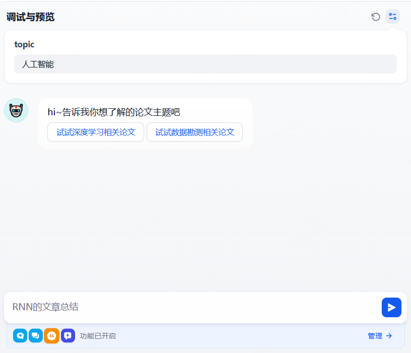

3. 评估与迭代 （如你希望开发的智能体能发挥作用，这一步不能省略！）：  
   **3.1 检查回复：**
   - 回答 **是否正确** ？是否基于知识库？
   - 回答**语气**是否符合预期（如“友好”）？
   - 回答是否**简洁友好**？
   - 对于无法回答的问题，是否**正确处理**（如会告知转交专业团队）？

   **3.2 发现问题？调整！**
   - **答案不准/不相关？**
     - 检查**提示词**是否清晰限定了职责和范围。
     - 检查**知识库文档**本身是否覆盖了该问题？可能需要补充上传文档。
   - **答案冗长/风格不对？**
     - 在**提示词**中更明确地要求（如“回答请控制在100字以内”，“请使用X语气风格”）
     - 调整大模型参数 **温度** (调低) 或 **最大生成长度** (调小)。
   - **LLM“幻觉”/编造答案？**
     - **强化提示词限制：** 在提示词中加入强约束语句（如“仅根据提供的知识库内容回答问题。如果知识库中没有明确答案，请直接说‘根据现有资料，我暂时无法回答这个问题，我会记录下来并转交专员处理’”）。
     - **检查知识库覆盖度：** 确保用户可能问的核心问题在知识库中有答案。调低 **温度**。

**重复步骤 2-3：** 不断修改提示词、调整变量/知识库/模型参数 -> 测试 -> 评估，直到对智能体的表现满意为止。**调试是构建好智能体的关键环节！**

## 四、发布与使用：让你的智能体上岗
   1. **发布智能体：**   
当你对调试结果满意后，点击编排界面右上角的 **“发布”** 按钮。默认情况下，你发布的智能体仅你本人可见。如需允许他人使用，请调整其可见范围。  
**提示：** 后续对提示词、知识库等的修改需要再次 **“发布”** 才能生效。  
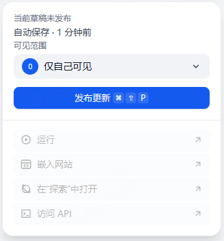

   2. **找到并使用你的智能体：**   
- 离开【工作室】，进入平台的 **【探索】** 页面。
- 在应用列表中找到你刚刚发布的智能体（例如：**智能客服小助手**）。
- 点击该智能体，会有一个 **“新的对话”** 按钮。  
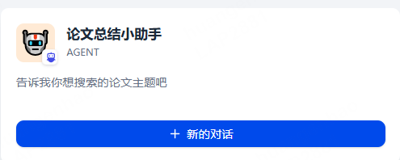

- 点击后，即打开一个聊天窗口，就能像使用普通聊天软件一样与你的智能客服助手对话了！  
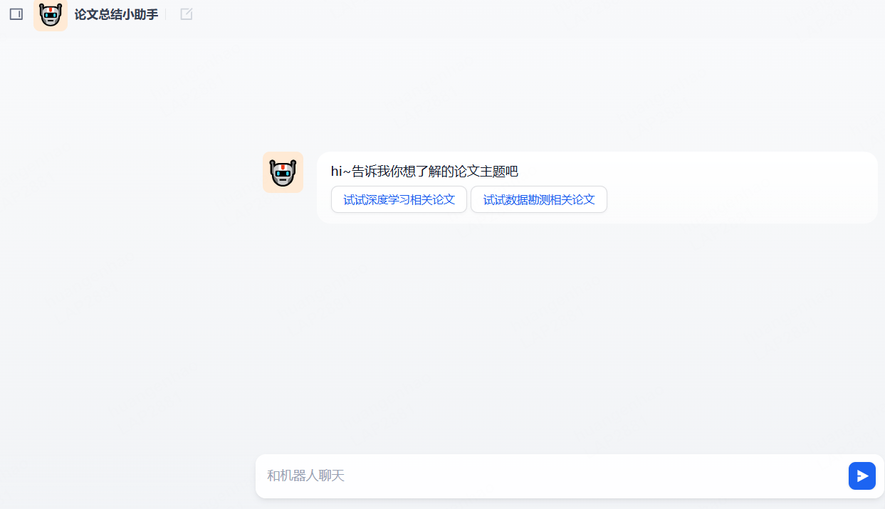

